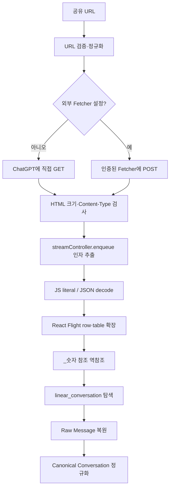
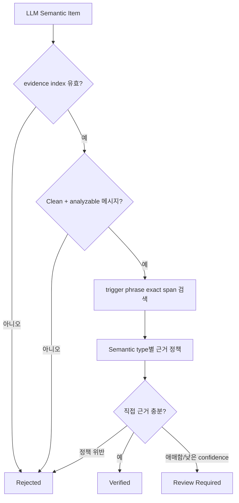
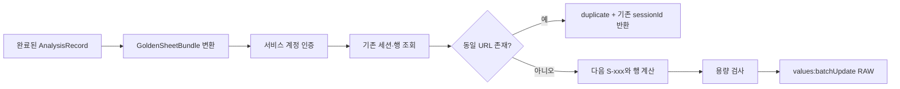
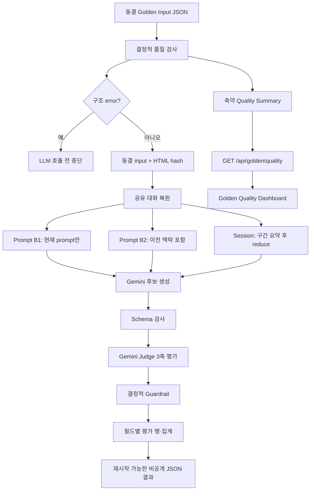
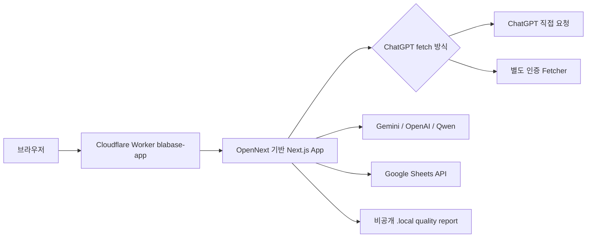

# blabase 전체 시스템 흐름

> 기준일: 2026-07-20
> 상태: 현재 코드 기준 AS-IS 문서
> 범위: ChatGPT 공유 대화 수집, 복원, 정규화, Rule/LLM 추출, Evidence 검증,
> 결과 조회, Atlas, Golden Dataset 등록 및 오프라인 평가

## 1. 시스템 한눈에 보기

blabase는 ChatGPT 공유 링크에서 대화를 복원한 뒤, 사용자에게 보이는 대화와
도구/내부 메시지를 분리하고, Rule Extractor와 선택적 LLM Shadow Extractor로
의미 항목을 추출한다. LLM 결과는 원문 근거와 다시 대조해 검증 상태를 붙이고,
브라우저의 Extraction Monitor와 Structure Map에서 원문까지 추적할 수 있게
표시한다.

현재 Rule 결과와 LLM 결과는 **하나의 최종 결과로 병합되지 않는다.** Rule 결과가
기존 기준 결과이고, LLM은 Shadow 비교 결과이며, Evidence Verifier도 LLM 후보에만
적용된다.

```mermaid
flowchart LR
    U[사용자] --> H[홈 / 공유 URL 입력]
    H --> A[POST /api/analyses]
    A --> I[ChatGPT Share Adapter]
    I --> C[Canonical Conversation]
    C --> R[Rule Extractor]
    R --> RS[Rule Semantic Items]
    C --> S[LLM Shadow Segmentation]
    R --> S
    S --> L[LLM Provider]
    L --> LI[LLM Semantic Items]
    LI --> V[Evidence Verifier]
    C --> V
    RS --> HR[Hybrid Shadow Result]
    V --> HR
    HR --> M[서버 메모리 AnalysisRecord]
    HR --> B[POST 응답 monitorData]
    B --> BC[브라우저 메모리 + sessionStorage]
    BC --> UI[Extraction Monitor]
    M --> API[결과·메시지·내보내기 API]
    API --> UI
    UI --> AT[Structure Map / Atlas]
    UI --> GA[GPT Audit Markdown]
    UI --> GS[Golden Dataset Sheet 등록]
```



## 2. 런타임 분석 흐름

### 2.1 공유 링크 제출

1. 사용자가 홈 화면의 `UrlInputForm`에 `https://chatgpt.com/share/...` 링크를
   입력한다.
2. 브라우저가 `POST /api/analyses`에 `{ "shareUrl": "..." }`를 전송한다.
3. API는 Zod로 요청 본문을 검사한다.
4. 요청이 유효하면 같은 HTTP 요청 안에서 복원, Rule 추출, 선택적 LLM 호출,
   Evidence 검증까지 순차적으로 완료한다.
5. 성공 응답은 `analysisId`, Shadow 실행 요약, 전체 `monitorData`를 함께 반환한다.
6. 브라우저는 `monitorData`를 메모리와 `sessionStorage`에 캐시하고
   `/analyses/{analysisId}?tab=turns`로 이동한다.

분석 생성 API는 현재 비동기 작업 큐가 아니다. 클라이언트가 응답을 받을 때에는
해당 분석이 이미 `completed` 또는 `failed` 상태다.

### 2.2 ChatGPT 공유 페이지 가져오기

`importChatGPTShareUrl()`의 처리 순서는 다음과 같다.



- URL은 HTTPS `chatgpt.com/share/{id}` 형식만 허용한다.
- `CHATGPT_SHARE_FETCHER_URL`이 있으면
  `CHATGPT_SHARE_FETCHER_SECRET` Bearer 인증으로 별도 Fetcher를 호출한다.
- Fetcher가 없으면 애플리케이션 서버가 ChatGPT에 직접 요청한다.
- 직접 fetch의 기본 timeout은 10초이며, 직접 fetch와 별도 Fetcher는 HTML을
  기본 20 MiB까지 허용한다.
- 원본 HTML은 저장하지 않고 SHA-256과 enqueue payload 개수만 Adapter 반환값에
  포함한다. 현재 분석 레코드에는 이 `raw` 메타데이터도 저장하지 않는다.
- `linear_conversation`을 찾지 못하거나 메시지를 복원하지 못하면 분석 전체가
  실패한다.

### 2.3 대화 정규화와 메시지 분류

복원된 메시지는 순서가 다시 매겨진 `CanonicalConversation`으로 변환된다.

| 분류 | 의미 | 의미 추출 사용 방식 |
|---|---|---|
| `clean_conversation` | 사용자에게 보이는 user/assistant 대화 | Rule 및 LLM의 주 분석 입력 |
| `context_signal` | 검색, 도구 호출/결과, 파일 작업 등 | Rule의 토픽/출처 보조 정보로만 사용, LLM 주 입력에서는 제외 |
| `excluded_internal` | thoughts, reasoning recap, model/system context 등 | 의미 분석에서 제외 |

정규화 단계의 주요 처리:

- system 역할 메시지를 제거한다.
- user, assistant, tool, unknown 역할을 표준화한다.
- 텍스트와 코드 블록을 `ContentBlock`으로 나눈다.
- 지원하지 않는 멀티모달 콘텐츠는 placeholder로 바꾸고 warning을 남긴다.
- 도구/검색/명령과 assistant transition/final answer 유형을 휴리스틱으로 분류한다.
- 메시지별 원본 ID, 원본 순서, 모델 slug, 생성/수정 시간을 보존한다.
- 전체/역할별/분류별 메시지 수, 문자 수, 시작·종료 시간과 기간을 계산한다.

### 2.4 Rule Extractor

`extractMockStructure()`는 결정적인 정규식·휴리스틱 기반 추출기다. 이름에
`Mock`이 남아 있지만 현재 런타임의 Rule 기준 결과로 사용된다.

입력과 출력의 관계는 다음과 같다.

```text
CanonicalConversation
├─ Clean user/assistant messages
│  ├─ Overview
│  ├─ Topic Flow
│  ├─ Preference Signals
│  ├─ Content Constraints
│  ├─ Problem Signals
│  ├─ Satisfaction Signals
│  └─ Board
│     ├─ Decisions
│     ├─ Open Questions
│     └─ Actions
├─ Context Signals
│  └─ topic/source-backed 보조 메타데이터
└─ Excluded/Internal
   └─ 분석 제외 + 진단 개수만 반영
```

Rule Extractor는 다음 안전 장치를 함께 적용한다.

- 코드 블록과 near-duplicate 메시지 처리
- 예시처럼 보이는 텍스트의 confidence 제한
- assistant 제안과 사용자의 명시적 결정 구분
- assistant 제안 직후 사용자 수락을 별도 결정 근거로 연결
- assistant 답변과 다음 user reaction을 한 쌍으로 묶은 satisfaction 판정
- 상충하는 결정 우선순위와 review 필요 여부 계산
- context signal을 사용자 의미의 직접 근거로 승격하지 않음

구조화 결과는 `convertRuleResultToSemanticItems()`에서 공통 `SemanticItem` 형식으로
변환된다. 공통 타입은 intent, topic, decision, open question, action,
preference, content constraint, problem signal, satisfaction, change event,
entity, relation이다.

### 2.5 LLM Shadow Extractor

LLM Shadow는 Rule 결과를 대체하지 않으며 다음 조건에서만 외부 API를 호출한다.

- `BLABASE_LLM_SHADOW_ENABLED=true`
- 선택한 provider의 API key가 존재

지원 provider는 Gemini, OpenAI, Qwen이다. `BLABASE_LLM_PROVIDER`가 없거나 잘못된
값이면 OpenAI가 기본값이다.

#### 세그먼트 생성

1. `clean_conversation`이면서 `semanticAnalyzable !== false`인 메시지만 선택한다.
2. Rule Extractor의 Topic Flow를 구간 경계 힌트로 사용한다.
3. 기본 한도인 28,000자, 40개 메시지, 최대 12개 구간에 맞춰 분할·병합한다.
4. 구간의 첫 user reaction 해석을 위해 바로 앞 assistant 메시지 하나만
   `contextOnly`로 겹쳐 보낼 수 있다.
5. 구간은 기본 3개, 최대 4개 동시 요청으로 처리한다.

#### Provider 호출과 결과 정리

- OpenAI와 Gemini는 JSON Schema Structured Output을 요청한다.
- Qwen은 JSON object mode로 호출한 뒤 공통 Zod schema로 다시 검사한다.
- 각 구간은 완료/실패, latency, request/response model, token usage를 기록한다.
- 일부 구간만 실패하면 전체 상태는 `partial`, 전부 실패하면 `failed`다.
- 성공 구간의 후보는 실패 구간이 있어도 보존한다.
- `type + status + trigger phrase/label + evidence index`가 같은 후보는 하나로
  합치고 confidence가 높은 후보를 남긴다.
- 모든 LLM 후보는 처음에는 `reviewRequired: true`다.

Shadow가 비활성화됐거나 API key가 없으면 Rule 흐름은 그대로 완료되고, LLM 결과만
`disabled` 상태와 사유를 가진다.

### 2.6 Evidence Verifier

`EvidenceVerifier`는 LLM 후보를 Canonical Conversation과 규칙 기반으로 대조한다.
추가 LLM 호출은 하지 않는다.



핵심 정책:

- intent, preference, content constraint, problem signal, change event는
  직접적인 user 근거가 필요하다.
- decision은 명시적 user 결정 또는 assistant 제안과 바로 뒤 user 수락 조합이
  필요하다.
- satisfaction은 assistant final answer와 다음 user reaction의 쌍이 필요하다.
- open question과 action은 실제 질문/요청 표현인지 확인한다.
- trigger phrase가 실제 메시지에 있으면 정확한 `startChar`, `endChar`를 남긴다.
- 잘못된 index나 Context/Internal 근거는 reject한다.
- 인용 불일치, 암시적 판단, confidence 0.75 미만은 주로 review 대상으로 보낸다.

최종 `HybridExtractionResult`에는 Rule Items, LLM 실행/구간/coverage 정보,
`verifiedItems`, `reviewQueue`, `rejectedItems`, 진단 집계가 함께 저장된다.

### 2.7 분석 저장과 브라우저 전달

현재 영구 DB는 없으며 두 저장 계층을 사용한다.

| 계층 | 저장 대상 | 수명/제약 |
|---|---|---|
| 서버 `MemoryAnalysisStore` | URL, Canonical Conversation, Rule 결과, Hybrid 결과, 오류 | 프로세스/isolate 수명. 재시작 또는 다른 isolate에서 사라질 수 있음 |
| 브라우저 메모리 캐시 | 전체 `AnalysisMonitorPayload` | 현재 페이지 실행 수명 |
| 브라우저 `sessionStorage` | 전체 `AnalysisMonitorPayload` JSON | 같은 브라우저 탭 세션. 저장 용량을 넘으면 기록 실패 |
| 브라우저 `localStorage` | 마지막 Atlas `analysisId`만 | 결과 본문은 저장하지 않음 |

POST 응답에 `monitorData` 전체를 포함하는 이유는 Cloudflare Workers의 다음 요청이
다른 isolate로 가더라도, 최초 결과 화면이 서버 메모리 조회 없이 열리게 하기
위해서다.

Extraction Monitor는 다음 순서로 데이터를 읽는다.

1. 브라우저 메모리 캐시
2. `sessionStorage`
3. 둘 다 없으면 서버의 result/messages API 병렬 조회

반면 `/atlas` 독립 화면은 현재 브라우저의 `monitorData` 캐시를 사용하지 않고
`analysisId`로 서버 API를 다시 조회한다. 서버 분석 레코드가 사라진 상태에서는
마지막 ID가 남아 있어도 실제 Atlas 데이터를 복구할 수 없다.

## 3. 결과 화면 흐름

### 3.1 Extraction Monitor

`/analyses/{analysisId}`는 복원 메시지를 Turn 단위로 다시 구성한다.

- 하나의 Turn은 clean user 메시지부터 다음 clean user 메시지 직전까지다.
- 해당 범위의 최종 assistant 답변을 대표 답변으로 선택한다.
- 중간 assistant 메시지, context signal, excluded/internal 메시지는 별도로 보존한다.
- Rule/LLM 항목은 evidence message index를 통해 Turn에 연결된다.

화면 탭:

| 탭 | 역할 |
|---|---|
| Structure Map | 의미 항목을 개념 노드, 공유 evidence/turn 기반 링크, 대화 흐름으로 표시 |
| Turns | 원문 Turn과 Rule/LLM 비교, Evidence 원문 이동 |
| Review Queue | Rule review 항목과 LLM review/rejected 항목 정렬 |
| Diagnostics | Parsing QA, LLM 세그먼트, coverage, token, Evidence 진단 |

Structure Map은 Rule 항목과 reject되지 않은 LLM 항목을 사용한다. 같은 타입과
정규화된 label은 한 노드로 묶고, 공통 evidence message나 Turn이 있는 노드끼리
연결한다. 현재 최대 14개 노드와 24개 링크를 표시한다.

### 3.2 Atlas

- `/atlas?analysisId=...`는 동일한 `ThreadStructure` 시각화를 전체 화면으로 연다.
- 분석 ID가 없으면 정적 인터랙티브 데모를 표시한다.
- 실제 분석을 열면 마지막 ID를 `localStorage`에 기억한다.
- 노드에서 Turn을 열면 `/analyses/{analysisId}?tab=turns&turn={n}`으로 이동한다.

`AtlasDashboard`와 `atlasModel.ts`에는 별도의 정적 대형 Atlas 데이터/화면도
존재하지만, 현재 `/atlas` 라우트가 렌더링하는 컴포넌트는
`AtlasStructurePage -> ThreadStructure`다.

## 4. API와 보조 기능

| Method | 경로 | 역할 | 주요 데이터 출처 |
|---|---|---|---|
| `POST` | `/api/analyses` | 새 분석 전체 실행 | ChatGPT 공유 링크 |
| `GET` | `/api/analyses/{id}/result` | Rule + Sprint 5 결과 조회 | 서버 메모리 |
| `GET` | `/api/analyses/{id}/messages` | Canonical 메시지와 분류 그룹 조회 | 서버 메모리 |
| `GET` | `/api/analyses/{id}/gpt-audit` | 검수용 Markdown 다운로드 | 서버 메모리 |
| `POST` | `/api/analyses/{id}/golden-sheet` | 현재 분석을 Golden Sheet 라벨링 틀에 등록 | 서버 메모리 + Google Sheets |
| `GET` | `/api/golden/quality` | 비식별·축약된 최신 품질 요약 조회 | 비공개 로컬 quality JSON |
| `GET` | `/api/debug/share-fetch?url=...` | 공유 HTML fetch 단계 진단 | ChatGPT/Fetcher |
| `GET` | `/api/debug/share-payloads?url=...` | payload 구조 요약 진단 | ChatGPT/Fetcher |

### 4.1 GPT Audit 내보내기

검수 파일은 분석 메타데이터, 분리 집계, Rule 구조, Evidence, trigger phrase,
Rule/LLM 비교, LLM 구간/토큰/coverage, Evidence 검증 결과, Clean Conversation 원문,
Context Signals, Internal preview를 Markdown으로 생성한다.

이 파일에는 공유 URL과 대화 원문이 들어가므로 비공개 검수 자료로 취급해야 한다.

### 4.2 Golden Dataset Sheet 등록

Golden Sheet 등록은 분석 성공과 분리된 명시적 사용자 동작이다.



쓰기 범위:

- `00_세션목록`: 세션 ID, 제목, URL, 수집일, 상태, 시간 메타데이터
- `01_전체메시지`: 전체 메시지, 역할, 분류, 분석 대상 여부
- `02_프롬프트판정`: clean user prompt마다 비어 있는 사람 판정 행
- `03_세션요약`: 세션 ID와 제목만 생성
- `04_예상추출항목`: 자동 생성/수정하지 않음

원문이 수식으로 실행되지 않도록 Google Sheets에는 `RAW` 값으로 쓴다. 등록했다고
해당 대화가 자동으로 Gold가 되는 것은 아니며, 사람 검수와 별도 승격 결정이
필요하다.

## 5. Golden Dataset 품질 검사와 베이스라인 평가

이 경로는 사용자 요청을 처리하는 런타임과 분리된 오프라인 개발/평가 흐름이다.
비공개 입력과 전체 결과는 `.local/` 등에 두며 Git에 커밋하지 않는다.



현재 `gold-core-v0.1` 베이스라인의 핵심 규칙:

- 동결 데이터셋은 내용을 바꾸지 않고, 수정 시 새 version/hash를 만든다.
- S-001~S-020의 승인된 prompt 필드와 session summary만 사용한다.
- 후보는 현재 prompt만, 이전 맥락 포함, 전체 session 조건으로 생성한다.
- Judge는 의미 일치도, 완전성, 근거성을 0~2점으로 평가한다.
- 후보와 Judge가 같은 Gemini 계열일 수 있으므로 자동 점수는 사람 승인이 아니다.
- 빈 Gold/빈 후보, 빈 Gold의 생성, Gold 누락, session judgment 불일치는 결정적
  guardrail로 보정한다.
- 같은 출력 경로로 다시 실행하면 완료된 대상을 건너뛰며 중간 결과를 이어서 쓴다.
- 데이터셋 hash가 다른 실행 결과를 직접적인 개선/회귀로 비교하지 않는다.

Golden Quality API는 전체 보고서를 그대로 반환하지 않는다. dataset version,
Gold snapshot hash, report version, 생성 시간, error/warning 개수, warning code와
안전한 target ID만 allowlist 방식으로 반환하며 `Cache-Control: no-store`를 쓴다.

## 6. 배포와 외부 시스템



- Next.js 앱은 `@opennextjs/cloudflare`로 빌드되어 `blabase-app` Worker에서
  실행된다.
- `blabase.com/*`, `www.blabase.com/*` Route가 이 Worker를 향한다.
- 정적 자산은 `.open-next/assets` binding으로 서비스한다.
- ChatGPT가 Worker 직접 요청을 차단하는 환경에서는 별도 Node Fetcher를 두고
  secret으로 인증한다.
- LLM Shadow를 켜면 Clean Conversation 내용이 선택한 외부 LLM provider로
  전송된다.
- Golden Sheet 등록 시 대화 원문이 Google Sheets로 전송된다.

## 7. 오류와 fallback 흐름

### 분석 생성 실패

- URL, HTML fetch, payload decode, 대화 복원 중 오류가 나면 failed
  `AnalysisRecord`를 만들고 400 응답을 반환한다.
- 내부 로그에는 정규화된 code/detail을 기록하지만, UI에는 사용자용 메시지를
  반환한다.
- LLM Shadow만 실패하면 분석 전체는 실패하지 않는다. Rule 결과는 유지되고
  LLM 상태만 `partial`, `failed`, `disabled`가 된다.

### 결과 조회 실패

- 브라우저 캐시가 있으면 서버 메모리가 없어도 최초 Extraction Monitor는 열린다.
- 캐시가 없고 서버 메모리에도 분석 ID가 없으면 404다.
- 서버 재시작 후 이전 분석 URL을 영구 복구하는 기능은 없다.

### 외부 연동 실패

- GPT Audit과 Golden Sheet는 서버 메모리의 완료된 분석이 있어야 한다.
- Golden Sheet 설정 누락은 503, 용량 초과는 409, Sheets API 오류는 502로
  정규화한다.
- Golden Quality report가 없으면 404, 너무 크거나 잘못된 형식이면 503이다.

## 8. 핵심 데이터 계약

| 계약 | 역할 |
|---|---|
| `CanonicalConversation` | 정규화된 대화, source, messages, stats, warnings |
| `CanonicalMessage` | 순번, 역할, 텍스트/블록, sourceRef, 분류 메타데이터 |
| `MockStructureResult` | Rule 기반 overview/topic/board/signals/evidence/diagnostics |
| `SemanticItem` | Rule과 LLM이 공유하는 의미 항목 형식 |
| `ShadowLlmResult` | provider/model, 상태, 구간, 후보, token/latency/coverage |
| `EvidenceEvaluatedItem` | LLM 항목 + verified/review/rejected 판정과 span/issues |
| `HybridExtractionResult` | Rule Items + LLM 결과 + Evidence 검증 묶음 |
| `AnalysisRecord` | 한 분석의 서버 메모리 저장 단위 |
| `AnalysisMonitorPayload` | 결과 화면에 전달하는 result/messages 묶음 |

## 9. 주요 코드 위치

```text
src/app/
├─ page.tsx                              # 새 분석 홈
├─ analyses/[analysisId]/page.tsx        # Extraction Monitor 진입
├─ atlas/page.tsx                        # Structure Map 독립 화면
├─ golden/quality/page.tsx               # Golden 품질 대시보드
└─ api/                                  # 분석·내보내기·Golden·debug API

src/core/
├─ adapters/chatgpt-share/               # URL → Canonical Conversation
├─ extractors/mockStructureExtractor.ts  # Rule 기준 추출
├─ extractors/llmShadow*.ts              # LLM 구간·prompt·결과 처리
├─ extractors/providers/                 # Gemini/OpenAI/Qwen adapter
├─ validation/evidenceVerifier.ts        # LLM Evidence 검증
├─ storage/analysisStore.ts              # 서버 메모리 저장소
├─ transport/analysisMonitorPayload.ts   # 브라우저 전달 계약
├─ golden-sheet/                         # Google Sheet 등록
├─ golden-baseline/                      # 품질 검사·평가 계약
└─ export/gptAuditExport.ts              # 검수 Markdown 생성

src/components/
├─ UrlInputForm.tsx                      # 분석 생성·브라우저 캐시
├─ extraction-monitor/                   # Turn/비교/검토/진단/Structure Map
├─ atlas/                                # Atlas 실제 화면과 데모 데이터
└─ golden-quality/                       # 축약 품질 보고서 UI

tools/
├─ chatgpt-fetcher/server.mjs            # 별도 인증 HTML Fetcher
├─ validate-golden-dataset.ts            # 결정적 Golden 품질 검사
├─ run-golden-baseline.ts                # 재시작 가능한 베이스라인 실행
├─ apply-golden-baseline-guardrails.ts   # 결과 guardrail 재적용
└─ emit-golden-baseline-sheet.mjs        # 평가 행 출력
```

## 10. 현재 구조의 경계

1. 영구 DB, 사용자 계정, 분석 목록, 다른 기기 공유가 없다.
2. 서버 메모리와 브라우저 session에 의존하므로 장기 보관이 되지 않는다.
3. Atlas 독립 화면은 결과 본문 캐시가 아니라 서버 API에 의존한다.
4. Rule/LLM conflict resolver와 최종 통합 결과는 아직 없다.
5. LLM Shadow 실행은 외부 provider 가용성, 비용, latency에 영향을 받는다.
6. 멀티모달 콘텐츠는 placeholder만 남기고 의미 분석하지 않는다.
7. Golden Sheet 등록은 라벨링 행 생성일 뿐 자동 Gold 승격이 아니다.
8. 현재 Golden Core는 dev 데이터이며, 잠금 Holdout 일반화 성능을 나타내지 않는다.

## 11. 변경 시 확인 기준

- 복원/정규화 변경: Adapter version, normalization 영향, fixture와 integration test
- Rule 변경: rule/extractor version, 관련 unit test, 동일 동결 데이터 회귀 확인
- LLM prompt/구간/provider 변경: prompt/extractor version, token/latency/coverage 비교
- Evidence 정책 변경: verifier version, verified/review/rejected 변화 기록
- Golden 변경: 새 dataset version과 SHA-256, 기존 동결본 보존
- 의미 출력이 바뀌는 변경: Engine Change Record 작성
- UI만 바뀌고 입력·출력·필터·순서·해석이 동일한 변경: Golden baseline 재실행 불필요

세부 기록 규칙은
[`ENGINE_DEVELOPMENT_RECORDS.md`](ENGINE_DEVELOPMENT_RECORDS.md)를 따른다.
